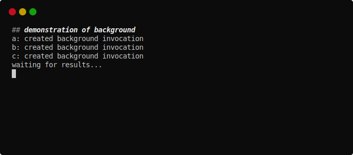

# background

[](https://github.com/disruptek/background/actions?query=workflow%3ACI)
[](https://github.com/disruptek/background/releases/latest)

[](#license)
[](https://matrix.to/#/#cps:matrix.org)
[](https://web.libera.chat/#cps)

Issue any function call in a background thread.

## Caveats

- you must compile with `--gc:arc` or `--gc:orc`
- you must compile with `--threads:on`
- due to Nim bugs, your function declaration must specify types for all parameters.

## Usage

Prefix your function call with `background` to immediately run it in a
background thread. The return value may be invoked to retrieve any result
of the call.

```nim
import background

proc greet(): int =
  echo "hello"
  result = 42

let greeting = background greet()  # run greet() in background
assert greeting() == 42            # recover any return value
echo greeting()                    # it's still 42, buddy
```

Here's [a slightly more interesting example from the tests](tests/test.nim)
in which we make three expensive calls in the background and recover their
results.

```nim
# we'll use this to track when threads terminate
var q {.global.}: int

# our "expensive" call
proc fib(n: int; o: int = 0): int =
  result =
    case n
    of 0, 1:
      1
    else:
      fib(n-1) + fib(n-2)

  # tracking termination order
  if o > 0:
    q.inc o

let
  x = 44   # 3rd most expensive
  y = 46   #     most expensive
  z = 45   # 2nd most expensive

let a = background fib(x)
checkpoint "a: created background invocation"

let b = background fib(y, o = 3)
checkpoint "b: created background invocation"

let c = background fib(z, 2)
checkpoint "c: created background invocation"

checkpoint "waiting for results..."

checkpoint "a: return value ", a()
check a() == 1134903170
check q == 0
checkpoint "b: return value ", b()
check b() == 2971215073
check q == 5
checkpoint "c: return value ", c()
check c() == 1836311903
check q == 5
```

The output from the tests looks like this:


## Installation

```
$ nimph clone disruptek/background
```
or if you're still using Nimble like it's 2012,
```
$ nimble install https://github.com/disruptek/background
```

## Documentation

[The documentation employs Nim's `runnableExamples` feature to
ensure that usage examples are guaranteed to be accurate. The
documentation is rebuilt during the CI process and hosted on
GitHub.](https://disruptek.github.io/background/background.html)

## License
MIT
